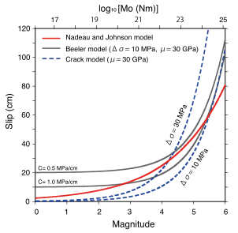

Slip Models
-----------

Following :cite:t:`Uchida2019`, Requake provides different models to estimate
fault slip (or creep) from repeating earthquakes magnitude.

First of all, magnitude is converted to seismic moment using the well known
formula of :cite:t:`Hanks1979` (seismic moment :math:`M_0` in
:math:`\Nm`):

.. math::

   M_0 = 10^{1.5(M_w + 6.07)}

or (seismic moment :math:`M_0` in :math:`\dynecm`):

.. math::

   M_0 = 10^{1.5(M_w + 10.7)}

Then, slip is estimated using one of the three models discussed below,
selectable using the ``mag_to_slip_model`` parameter in the
:ref:`configuration_file`.
See **Figure 1** for a comparison of the three models.

  **Figure 1** Relationship between magnitude (or seismic moment) and slip for
  three models. Figure from :cite:t:`Uchida2019`.

Nadeau and Johnson (1998)
^^^^^^^^^^^^^^^^^^^^^^^^^

:cite:t:`Nadeau1998` proposed the following empirical relationship between
the seismic moment of a repeting earthquake (:math:`M_0` in
:math:`\dynecm`) and the fault slip around it (:math:`d` in :math:`\cm`):

.. math::

   d = 10^{-2.36} M_0^{0.17}

This formula is selected by setting the ``mag_to_slip_model`` parameter to
``N1998``.

Beeler et al. (2001)
^^^^^^^^^^^^^^^^^^^^

:cite:t:`Beeler2001` proposed an alternative empirical model to explain the
recurrence intervals of the Parkfield repeaters, which accounts for the
possibility of aseismic slip around the repeating earthquakes asperities.
In this model the repeating earthquake asperity is allowed to continuously
creep and strain harden until reaching a failure threshold stress.
Their model for fault slip :math:`d` (in :math:`\cm`) is the following:

.. math::

   d = \Delta\sigma \left[
         \frac{1}{1.81\mu} \left(
            \frac{M_0}{\Delta\sigma}
         \right)^{\frac{1}{3}} +
         \frac{1}{C}
       \right]

where :math:`\Delta\sigma` is the static stress drop (in :math:`\MPa`),
:math:`\mu` is the rigidity (in :math:`\MPa`), :math:`M_0` is the seismic moment
(in :math:`\Nm`), and :math:`C` is the strain hardening coefficient
(in :math:`\MPacm`).

This formula is selected by setting the ``mag_to_slip_model`` parameter to
``B2001``. The values for staticx stress drop, rigidity and strain hardening
coefficient must be set in the :ref:`configuration_file`.

Eshelby (1957) circular crack model
^^^^^^^^^^^^^^^^^^^^^^^^^^^^^^^^^^^

A somehow simpler approach is to assume that the fault creep around the
repeater asperity is equal to the slip released by the repeater rupture.
Assuming a circular crack with constant stress-drop, one can derive the slip
(:math:`d`, in :math:`\cm`) as:

.. math::

   d = \frac{M_0}{\pi \mu a^2}

where :math:`M_0` is the seismic moment (in :math:`\Nm`), :math:`\mu`
is the rigidity (in :math:`\MPa`) and :math:`a` is the fault radius (in
:math:`\cm`).

The source radius (in :math:`\cm`) is obtained from the :cite:t:`Eshelby1957`
formula:

.. math::

   a = \left( \frac{7}{16} \frac{M_0}{\Delta \sigma} \right)^{\frac{1}{3}}

Where :math:`\Delta \sigma` is the static stress drop (in :math:`\MPa`).

This formula is selected by setting the ``mag_to_slip_model`` parameter to
``E1957``. The value for static stress drop must be set in the
:ref:`configuration_file`.